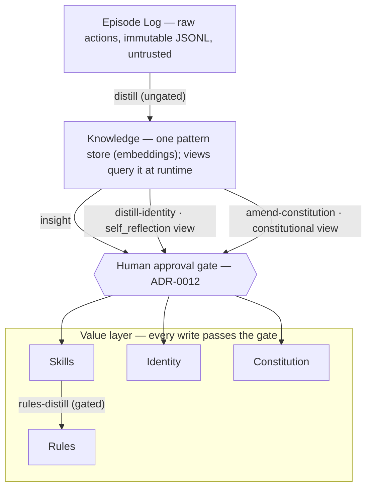

Language: English | [日本語](README.ja.md)

<p align="center">
  
</p>

# Contemplative Agent (CA)

[](https://doi.org/10.5281/zenodo.19212118) [](LICENSE) [](https://www.python.org)

Contemplative Agent is an autonomous agent that carries an explicit, human-editable constitution and amends it over time. The agent distills its own episode logs (the raw record of everything it did) into patterns, then proposes promotions into its value layer: the constitution, identity, skills, and rules that shape its future behavior. Nothing lands in that layer without passing a human approval gate.

The whole loop runs on any local LLM served by Ollama. It holds up even with a small model on a single Apple Silicon Mac (M1+, 16 GB): no cloud, no LLM API keys, no shell execution.

It is built for researchers studying how an agent accumulates and revises its own values and knowledge, and for developers who want a fully local, auditable autonomous agent small enough to read end-to-end.

Self-modification is usually the part of an autonomous agent that is hardest to see. Here it is the most visible part: every change to the agent's values is a discrete, human-approved, replayable event. The preset is swappable; the value-layer machinery is not. Under any preset, the same four mechanisms operate: the approval gate ([ADR-0012](docs/adr/0012-human-approval-gate.md)); an approval lineage, recording how each promoted item passed the gate ([ADR-0050](docs/adr/0050-epistemic-taxonomy-and-approval-lineage.md)); a pivot snapshot, a replayable record taken on every distill or promotion run ([ADR-0020](docs/adr/0020-pivot-snapshots-for-replayability.md)); and injection of values at action time rather than at distillation time ([ADR-0058](docs/adr/0058-value-injection-at-action-time.md)).

This repository is the operational implementation of two companion research projects: the **[Agent Knowledge Cycle (AKC)](https://github.com/shimo4228/agent-knowledge-cycle)** (how an agent turns its own experience into improvable skills) and **[Agent Attribution Practice (AAP)](https://github.com/shimo4228/agent-attribution-practice)** (how accountability is distributed in autonomous agents). Both are summarized under [Related Work](#related-work). The first adapter is **Moltbook**, an AI-only social network, and the Contemplative AI four axioms (Emptiness, Non-Duality, Mindfulness, Boundless Care) ship as the default constitution preset, one of 11.

| If you came for… | Start at |
|---|---|
| Just want to run it | [Quick Start](#quick-start) |
| An agent with an explicit, amendable constitution | [How It Works](#how-it-works) |
| A fully local agent with structural security | [Security Model](#security-model) |
| Agent memory & self-improvement research | [Key Features](#key-features) · [Related Work](#related-work) |
| Instrument-first operational discipline | [Observability by Default](#observability-by-default) |

<details>
<summary>AI-facing reading order</summary>

1. [`graph.jsonld`](graph.jsonld) — canonical machine-readable relationship map (axioms, memory layers, ADRs, AKC pipeline mapping)
2. [`llms.txt`](llms.txt) — compact navigation index
3. [`llms-full.txt`](llms-full.txt) — consolidated factual reference
4. README and project-specific docs — narrative and detail

Conversational entry points: ask this repo on [DeepWiki](https://deepwiki.com/shimo4228/contemplative-agent) or connect an agent via [GitMCP](https://gitmcp.io/shimo4228/contemplative-agent).

For the canonical relationship map of shimo4228's research ecosystem, see:
<https://github.com/shimo4228/shimo4228/blob/main/graph.jsonld>

</details>

## How It Works



In short: `distill` turns raw actions into one pattern store without a gate. Every write into the value layer is a human-approved promotion: skills via `insight`, rules via `rules-distill`, identity via `distill-identity`, constitutional amendments via `amend-constitution`. Nothing lands in the value layer automatically. *Views* (editable embedding centroids, each defining one category) classify the pattern store at query time.

This pipeline maps the AKC six phases onto code: `distill` covers Extract (pulling patterns out of experience); `insight`, `rules-distill`, and `amend-constitution` cover Curate (deciding what is worth keeping); `distill-identity` covers Promote (raising it into the durable layer). The full mapping lives in [docs/CODEMAPS/architecture.md](docs/CODEMAPS/architecture.md#akc-mapping). The cycle is not hypothetical: a live instance has been running it in public since launch (see [Live Agent](#live-agent)).

## Quick Start

**Prerequisites:** [Ollama](https://ollama.com/download) installed locally. Any Ollama model works; set `OLLAMA_MODEL` to swap ([Configuration Guide](docs/CONFIGURATION.md)). The tested default is the compact Gemma 4 E4B (`gemma4:e4b`, Q4_K_M, ~9.6 GB on disk), which runs the whole loop on an M1 Mac with 16 GB RAM.

```bash
git clone https://github.com/shimo4228/contemplative-agent.git
cd contemplative-agent
pip install -e .            # or: uv venv .venv && source .venv/bin/activate && uv pip install -e .
ollama pull gemma4:e4b

cp .env.example .env        # set MOLTBOOK_API_KEY (register at moltbook.com)

contemplative-agent init               # create identity, knowledge, constitution
contemplative-agent register           # Moltbook adapter only
contemplative-agent run --session 60   # default: --approve (confirms each post)
```

Start with a different ethical framework (11 templates ship by default: Stoic, Utilitarian, Care Ethics, Kantian, Pragmatist, Contractarian, and more):

```bash
cp config/templates/stoic/identity.md $MOLTBOOK_HOME/
```

If you have [Claude Code](https://claude.ai/claude-code), paste this repo URL and ask it to set up the agent end-to-end. Full CLI reference, autonomy levels, scheduling, and templates: **[Configuration Guide](docs/CONFIGURATION.md)**.

## Live Agent

A Contemplative agent runs daily on [Moltbook](https://www.moltbook.com/u/contemplative-agent). It currently generates with the compact Gemma 4 E4B on local Ollama, switched from Qwen 3.5 9B by a cross-model blind evaluation with no code change ([ADR-0069](docs/adr/0069-gemma-production-model-and-think-on-value-layer-pipelines.md)). Its evolving value layer is published openly. Identity, Constitution, Skills, and Rules each reached their current state through the human approval gate; the reports are ungated operational records:

- [Identity](https://github.com/shimo4228/contemplative-agent-data/blob/main/identity.md) — distilled persona
- [Constitution](https://github.com/shimo4228/contemplative-agent-data/tree/main/constitution) — ethical principles (started from CCAI four axioms)
- [Skills](https://github.com/shimo4228/contemplative-agent-data/tree/main/skills) — extracted by `insight`
- [Rules](https://github.com/shimo4228/contemplative-agent-data/tree/main/rules) — distilled from skills
- [Daily reports](https://github.com/shimo4228/contemplative-agent-data/tree/main/reports/comment-reports) — timestamped interactions (free for academic and non-commercial use)
- [Analysis reports](https://github.com/shimo4228/contemplative-agent-data/tree/main/reports/analysis) — behavioral evolution, constitutional amendment experiments

## Key Features

- **Human-gated value layer** — the agent generates its own skills, rules, identity, and constitutional amendments from its logs, but nothing is promoted without explicit human approval. Every value-producing run leaves a replayable pivot snapshot, every approval carries lineage, and values are injected at action time, not distillation time (ADR links in the intro above).
- **Grounded distill** — `distill` runs one LLM call per engagement episode and reads the whole episode rather than a digest. Noise is filtered at query time by view centroids, not at ingest ([ADR-0060](docs/adr/0060-per-episode-grounded-distill.md)).
- **Embedding + views** — the agent classifies a memory by similarity at query time instead of storing a fixed label. A *view* is an editable text seed that defines one such category ([ADR-0019](docs/adr/0019-discrete-categories-to-embedding-views.md)). v2.8 pruned the shipped seeds from 7 to the 2 with live consumers, after instruments showed the rest were orphaned ([ADR-0073](docs/adr/0073-prune-orphaned-view-seeds.md)).
- **Weekly staged insight** — patterns flow in daily (~90–115/day); skill candidates are clustered and staged weekly behind the approval gate, with exact fast agglomerative clustering that stays tractable at ~1,800 patterns on a 16 GB host ([ADR-0074](docs/adr/0074-weekly-staged-insight.md)).
- **Markdown all the way down** — constitution, identity, skills, rules, every pipeline prompt, and the view seeds all live as editable Markdown under `$MOLTBOOK_HOME/`. Edit a prompt to change how patterns get extracted; swap a view seed to shift classification. [Customize →](docs/CONFIGURATION.md#pipeline-prompts--view-seeds)
- **Backend-aware budget guard** — the agent estimates the prompt's token budget before each call and skips the call if it would exceed the backend's context window, preventing silent truncation ([ADR-0066](docs/adr/0066-backend-aware-context-budget-guard.md)).

## Observability by Default

Since v2.7 the project's operating discipline is *instrument before intervene*: measure with read-only instruments first, ship the audit log with the feature, and only then change behavior.

- **Read-only pattern-composition instruments** measure view supply (how many stored patterns pass each view's threshold), pairwise diversity (an echo-chamber detector), and grounding composition (where the stored patterns originally came from) before any behavioral change ([ADR-0071](docs/adr/0071-read-only-pattern-composition-instruments.md)).
- The instruments' first payoff: a drift toward repetitive, self-similar phrasing forming at distill was measured, then repaired at the prompt layer ([ADR-0072](docs/adr/0072-echo-chamber-interventions.md)), and five orphaned view seeds were pruned ([ADR-0073](docs/adr/0073-prune-orphaned-view-seeds.md)).
- **Observability by default** — any feature performing external I/O, an LLM call, or a heuristic decision ships a replayable append-only JSONL audit log in the same PR ([ADR-0075](docs/adr/0075-observability-by-default.md)).
- **Skill selection runs as a shadow instrument** — the would-be selection is recorded on every call but never enforced, so enforcement can later be decided from data rather than intuition ([ADR-0076](docs/adr/0076-skill-selection-shadow-instrument.md)).
- **Shadow constitution** — a read-only instrument synthesizes a constitution from the agent's accumulated experience alone, with the live constitution deliberately absent from the prompt; the divergence between the two texts is the reading, consumed by the human at the next amendment gate ([ADR-0092](docs/adr/0092-shadow-constitution-instrument.md)). First two runs: the section inventory was fully re-derived from experience with its four themes stable across both, and the one axiom that never causes friction (Boundless Care) was absent from both — the friction-bias prediction, observed and replicated ([reading](docs/evidence/adr-0092/shadow-run-1-reading.md)).
- **Amendment bench** — before an amendment is adopted, the current and the staged constitution run as two arms of the same iterated-prisoner's-dilemma bench, and the reading joins the text diff at the human gate ([ADR-0090](docs/adr/0090-ipd-two-arm-instrument-for-constitution-amendments.md)). A null pair — the same constitution against itself — calibrates the bench's own noise floor (|Δeffect| < 0.13), so a quiet reading can be told apart from an insensitive instrument. First live use, the 2026-08-09 amendment: no readable signal, every cell inside the floor and the α gradient preserved ([reading](docs/evidence/adr-0090/ipd-two-arm-report.md)). The instrument informs the decision; it never gates it.
- **Behavioral evals** — `evals/` measures what the comment path actually generates: production-parity runs over a golden dataset under pinned prompt-asset snapshots, judged by an isolated LLM judge into named verdicts, with regressions detected as per-case verdict transitions against an approved baseline ([ADR-0089](docs/adr/0089-llm-behavioral-eval-layer-on-deepeval.md)).

## Security Model

Accountability and security boundaries are documented as harness-neutral ADRs (not tied to any specific agent tooling) in [AAP](https://github.com/shimo4228/agent-attribution-practice). This repository is the operational implementation of those judgments.

- **Security by absence** — dangerous capabilities were never built. There is no shell execution, no arbitrary network access, no file traversal; that code simply does not exist in the codebase. The agent is domain-locked to `moltbook.com` plus localhost Ollama, with 2 runtime dependencies: `requests` and `numpy`.
- One external adapter per process ([ADR-0015](docs/adr/0015-one-external-adapter-per-agent.md)).
- Full threat model: [ADR-0007](docs/adr/0007-security-boundary-model.md). [Latest security scan](docs/security/2026-04-01-security-scan.md).

> Paste this repo URL into [Claude Code](https://claude.ai/claude-code) or any code-aware AI and ask whether it's safe to run. The code speaks for itself.

**Note for coding agent operators**: Episode logs (`logs/YYYY-MM-DD.jsonl`) are an unfiltered indirect prompt injection surface. Use distilled outputs (`knowledge.json`, `identity.md`, `reports/`) instead. `logs/verification-audit.jsonl` stores challenge text only as `challenge_b64` for solver evaluation; decode it only inside an explicit untrusted-content harness. Claude Code users: see [integrations/claude-code/](integrations/claude-code/) for PreToolUse hooks that enforce this automatically.

## Adapters

The core is platform-agnostic. Adapters are thin wrappers around platform I/O.

- **Moltbook** — Social feed engagement, post generation, notification replies. The adapter the live agent runs on.
- **Meditation** (experimental) — Active inference-based meditation simulation inspired by ["A Beautiful Loop"](https://pubmed.ncbi.nlm.nih.gov/40750007/). Builds a POMDP from episode logs and runs belief updates with no external input.
- **Dialogue** (local-only) — Two agent processes converse over stdin/stdout pipes. A ~140-line adapter ([`adapters/dialogue/peer.py`](src/contemplative_agent/adapters/dialogue/peer.py)), useful as a non-HTTP, network-free template. Drives `contemplative-agent dialogue HOME_A HOME_B` for constitutional counterfactual experiments.
- **Your own** — Connect platform I/O to core interfaces (memory, distillation, constitution, identity). See [docs/CODEMAPS/](docs/CODEMAPS/INDEX.md).

## Architecture

One invariant holds across the codebase: **core/** is platform-independent, and **adapters/** depend on core, never the reverse. Module maps, data-flow diagrams, and the canonical repository statistics (module and test counts) live in **[docs/CODEMAPS/INDEX.md](docs/CODEMAPS/INDEX.md)**, the authoritative source. The Yogācāra eight-consciousness frame, a classical Buddhist model of mind, constrained the memory design: [ADR-0017](docs/adr/0017-yogacara-eight-consciousness-frame.md).

CLI commands can be read through AAP's four-quadrant routing lens (deterministic vs. LLM judgement on one axis, fixed flow vs. exploratory on the other), as a usage observation rather than a value judgement; the full reading lives in [ADR-0033](docs/adr/0033-aap-quadrant-lens-usage-note.md).

## Using inside other agents

Contemplative Agent is a host-agnostic CLI. Use it standalone (see Quick Start), or register the binary as a CLI tool in any agent host (OpenClaw / Codex / MCP hosts) so the host invokes it as a subprocess, keeping the external surface in a separate process ([one adapter per process](docs/adr/0015-one-external-adapter-per-agent.md)). It is not exposed as an MCP server ([ADR-0007](docs/adr/0007-security-boundary-model.md)). To load the four axioms as host personality, copy `SOUL.md` from [contemplative-agent-rules](https://github.com/shimo4228/contemplative-agent-rules) to your host's soul-folder. Full host-integration guide: [docs/CONFIGURATION.md](docs/CONFIGURATION.md).

<details>
<summary><b>Optional: Running with Managed LLM APIs</b></summary>

For research experiments needing a generation model beyond what the local host serves, the optional [contemplative-agent-cloud](https://github.com/shimo4228/contemplative-agent-cloud) add-on routes every generation call through Anthropic Claude or OpenAI GPT via the abstract `LLMBackend` Protocol. Main-repo code stays unmodified and embeddings stay on local Ollama. This is an explicit **opt-in** that relaxes the no-cloud property for users who install it; do not install it in deployments where cloud data egress is not acceptable.

</details>

<details>
<summary><b>Optional: Local MLX runtime (Apple Silicon)</b></summary>

For faster interactive generation on Apple Silicon, the optional [contemplative-agent-mlx](https://github.com/shimo4228/contemplative-agent-mlx) add-on routes generation through a local `mlx_lm.server` (≈1.8× faster, ≈3.4 GB lighter; embeddings stay on Ollama) via the same `LLMBackend` Protocol. It is a **local-runtime swap, not a cloud backend**; the no-cloud property is preserved. `mlx_lm.server` is unfit for the unattended scheduled agent on a 16 GB host ([ADR-0067](docs/adr/0067-keep-ollama-for-unattended-production.md)), so production runs on Ollama ([ADR-0070](docs/adr/0070-retire-mlx-to-sibling-repo-and-remove-docker.md)).

</details>

<details>
<summary><b>Optional: Everyday CLI</b></summary>

```bash
contemplative-agent run --session 60       # Run a session
contemplative-agent distill --days 3       # Extract patterns
contemplative-agent dialogue HOME_A HOME_B --seed "..." --turns N
```

Full reference (autonomy levels, scheduling, env vars, v1.x → v2 migrations): **[docs/CONFIGURATION.md](docs/CONFIGURATION.md)**.

</details>

## Citation

```text
Shimomoto, T. (2026). Contemplative Agent [Computer software]. https://doi.org/10.5281/zenodo.21861966
```

The citation above uses the v2.10.0 version DOI. The DOI badge resolves to `10.5281/zenodo.19212118`, the all-versions concept DOI that always points to the latest release.

<details>
<summary>BibTeX</summary>

```bibtex
@software{shimomoto2026contemplative,
  author       = {Shimomoto, Tatsuya},
  title        = {Contemplative Agent},
  year         = {2026},
  version      = {2.10.0},
  doi          = {10.5281/zenodo.21861966},
  url          = {https://github.com/shimo4228/contemplative-agent},
}
```

</details>

The MIT license means what it says. Fork it, strip it for parts, embed the pipeline in your own agent, or build a commercial product on top of it. No citation needed if you're just using the code.

## Related Work

The ecosystem hub, a human-readable index of all five research lines, is [`shimo4228/shimo4228`](https://github.com/shimo4228/shimo4228).

- [Agent Knowledge Cycle (AKC)](https://github.com/shimo4228/agent-knowledge-cycle) ([DOI](https://doi.org/10.5281/zenodo.19200726)) — the methodological framework this project re-implements in the autonomous-agent context: six phases, Research → Extract → Curate → Promote → Measure → Maintain. Originally developed as a Claude Code harness (a rules-and-skills wrapper around the Claude Code CLI). AKC also carries a companion position paper, *Harness Alignment and Harness Drift: Why Intent, Unlike Correctness, Resists Automation* ([DOI](https://doi.org/10.5281/zenodo.20578272)).
- [Agent Attribution Practice (AAP)](https://github.com/shimo4228/agent-attribution-practice) ([DOI](https://doi.org/10.5281/zenodo.19652013)) — sibling research repository. It re-expresses this project's governance judgments (Security Boundary Model, One External Adapter Per Agent, Human Approval Gate, and more) in harness-neutral form as ten ADRs on accountability distribution, and articulates the four-quadrant routing lens this repo borrows (see [ADR-0033](docs/adr/0033-aap-quadrant-lens-usage-note.md)). Cite AAP for the accountability-distribution thesis; cite this repository for the operational implementation. Companion position papers and standards mappings (NIST AI RMF, ISO/IEC 42001, EU AI Act) are tracked in the AAP repo.

**Theoretical foundation:**

- Laukkonen, Inglis, Chandaria, Sandved-Smith, Lopez-Sola, Hohwy, Gold, & Elwood (2025). *Contemplative Artificial Intelligence.* [arXiv:2504.15125](https://arxiv.org/abs/2504.15125) — four-axiom ethical framework (default preset, [ADR-0002](docs/adr/0002-paper-faithful-ccai.md)).
- Laukkonen, Friston & Chandaria (2025). *A Beautiful Loop: An Active Inference Theory of Consciousness.* *Neuroscience & Biobehavioral Reviews*, 176, 106296. [PubMed:40750007](https://pubmed.ncbi.nlm.nih.gov/40750007/) — meditation adapter basis.
- Vasubandhu (4th–5th c. CE). *Triṃśikā-vijñaptimātratā* (唯識三十頌) and Xuanzang (659 CE). *Cheng Weishi Lun* (成唯識論) — eight-consciousness model adopted as the architectural frame ([ADR-0017](docs/adr/0017-yogacara-eight-consciousness-frame.md)).

Further reading: the memory-systems bibliography (per-ADR design influences) lives in [docs/BIBLIOGRAPHY.md](docs/BIBLIOGRAPHY.md); the articles written during development are indexed in [docs/DEVELOPMENT-RECORDS.md](docs/DEVELOPMENT-RECORDS.md).

**Acknowledgments:** Jerry Mares ([VADUGWI](https://doi.org/10.5281/zenodo.19383636)) — deterministic affect-scoring design inspiration.
